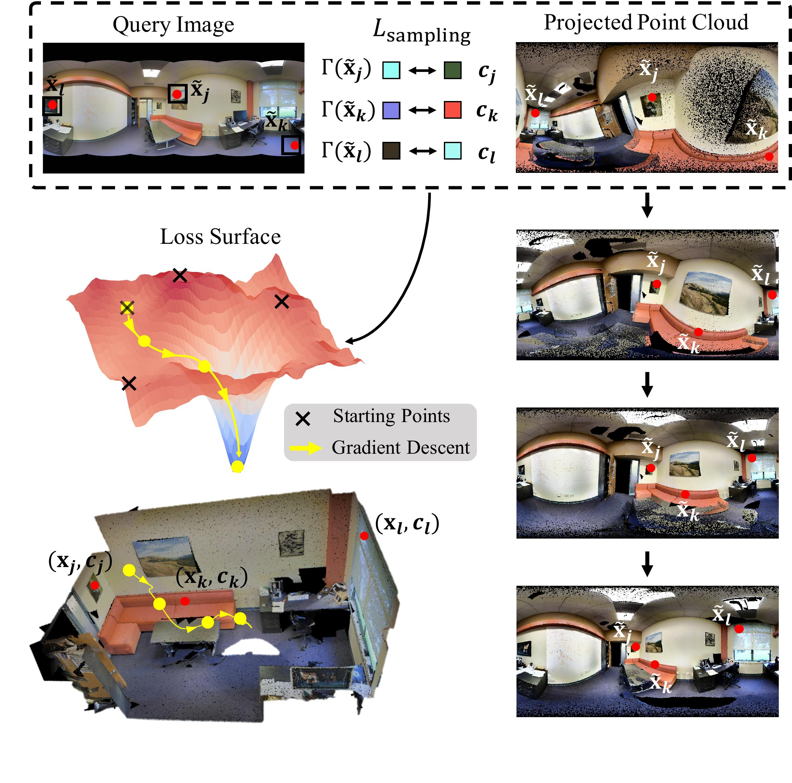
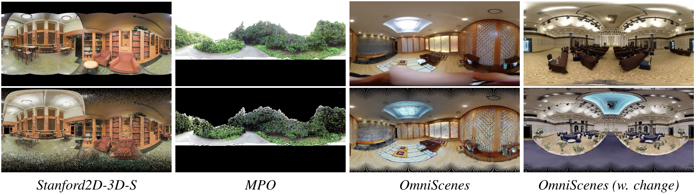

# PICCOLO: Point-Cloud Centric Omnidirectional Localization
Official PyTorch implementation of **PICCOLO: Point-Cloud Centric Omnidirectional Localization (ICCV 2021)** [[Paper]](https://openaccess.thecvf.com/content/ICCV2021/html/Kim_PICCOLO_Point_Cloud-Centric_Omnidirectional_Localization_ICCV_2021_paper.html) [[Video]](https://www.youtube.com/watch?v=E-_lEsChfoE).

\
PICCOLO is a simple, efficient algorithm for omnidirectional localization that estimates camera pose given a set of input query omnidirectional image and point cloud: **no additional preprocessing/learning is required!**

\
In this repository, we provide the implementation and instructions for running PICCOLO, along with the accompanying OmniScenes dataset. 
If you have any questions regarding the dataset or the baseline implementations, please leave an issue or contact 82magnolia@snu.ac.kr.

## Demo
Comping soon!

## Downloading OmniScenes
OmniScenes is our newly collected dataset for evaluating omnidirectional localization in diverse scenearios such as robot-mounted/handheld cameras and scenes with changes.
The dataset is comprised of images and point clouds captured from 7 scenes ranging from wedding halls to hotel rooms.
We are currently in the process of removing regions in the dataset that contains private information difficult to be released in public.
We will notify further updates through this GitHub repository.
