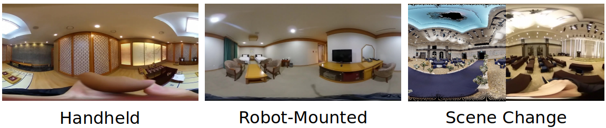

# PICCOLO: Point-Cloud Centric Omnidirectional Localization
:star2: **Update** :star2: Check out the panoramic localization library, which contains implementations of numerous panoramic localization algorithms including PICCOLO. Plus, it is more user-friendly than this repositoty! Here's the [link](https://github.com/82magnolia/panoramic-localization).

Official PyTorch implementation of **PICCOLO: Point-Cloud Centric Omnidirectional Localization (ICCV 2021)** [[Paper]](https://openaccess.thecvf.com/content/ICCV2021/html/Kim_PICCOLO_Point_Cloud-Centric_Omnidirectional_Localization_ICCV_2021_paper.html) [[Video]](https://www.youtube.com/watch?v=E-_lEsChfoE).

[](piccolo_overview.jpg)\
PICCOLO is a simple, efficient algorithm for omnidirectional localization that estimates camera pose given a set of input query omnidirectional image and point cloud: **no additional preprocessing/learning is required!**

[](qualitative.png)\
In this repository, we provide the implementation and instructions for running PICCOLO, along with the accompanying OmniScenes dataset. 
If you have any questions regarding the dataset or the baseline implementations, please leave an issue or contact 82magnolia@snu.ac.kr.

## Running PICCOLO
### Dataset Preparation
First ownload the panorama images (`pano`) and poses (`pose`) from the following [link](https://docs.google.com/forms/d/e/1FAIpQLScFR0U8WEUtb7tgjOhhnl31OrkEs73-Y8bQwPeXgebqVKNMpQ/viewform?c=0&w=1) (download the one without `XYZ`) and the point cloud (`pcd_not_aligned`) from the following [link](https://docs.google.com/forms/d/e/1FAIpQLScDimvNMCGhy_rmBA2gHfDu3naktRm6A8BPwAWWDv-Uhm6Shw/viewform?c=0&w=1).
Then, place the data in the directory structure below.

    piccolo/data
    └── stanford (Stanford2D-3D-S Dataset)
        ├── pano (panorama images)
        │   ├── area_1
        │   │  └── *.png
        │   ⋮
        │   │
        │   └── area_6
        │       └── *.png
        ├── pcd_not_aligned (point cloud data)
        │   ├── area_1
        │   │   └── *.txt
        │   ⋮
        │   │
        │   └── area_6
        │       └── *.txt
        └── pose (json files containing ground truth camera pose)
            ├── area_1
            │   └── *.json
            ⋮
            │
            └── area_6
                └── *.json

Note, to obtain results in OmniScenes, please refer to the download instructions [below](https://github.com/82magnolia/piccolo#downloading-omniscenes-update-new-scenes-added).
Then, place the data in the directory structure below.

    piccolo/data
    └── omniscenes (OmniScenes Dataset)
        ├── change_handheld_pano (panorama images)
        │   ├── handheld_pyebaekRoom_1_scene_2 (scene folder)
        │   │  └── *.jpg
        │   ⋮
        │   │
        │   └── handheld_weddingHall_1_scene_2 (scene folder)
        │       └── *.jpg
        └── change_handheld_pose (json files containing ground truth camera pose)
        |   ├── handheld_pyebaekRoom_1_scene_2 (scene folder)
        |   │   └── *.json
        |   ⋮
        |   │
        |   └── handheld_pyebaekRoom_1_scene_2 (scene folder)
        |       └── *.json
        ⋮
        └── pcd (point cloud data)
            ├── pyebaekRoom_1.txt
            │
            ⋮
            │
            └── weddingHall_1.txt


### Installation
To run the codebase, you need [Anaconda](https://www.anaconda.com/). Once you have Anaconda installed, run the following command to create a conda environment.

    conda create --name omniloc python=3.7
    conda activate omniloc
    pip install -r requirements.txt -f https://download.pytorch.org/whl/torch_stable.html 
    conda install cudatoolkit=10.1

In addition, you must install pytorch_scatter. Follow the instructions provided in [the pytorch_scatter github repo](https://github.com/rusty1s/pytorch_scatter). You need to install the version for torch 1.7.0 and CUDA 10.1.


### Running
To obtain results for the Stanford-2D-3D-S dataset, run the following command from the terminal:

    python main.py --config configs/stanford.ini --log logs/NAME_OF_LOG_DIRECTORY

The config above performs gradient descent sequentially for each candidate starting point.
We also provide a parallel implementation of PICCOLO, which performs gradient descent in parallel.
While this version faster, it shows slightly inferior performance compared to the sequential optimization version.
To run the parallel implementation, run the following command:

    python main.py --config configs/stanford_parallel.ini --log logs/NAME_OF_LOG_DIRECTORY

### Output
After running, four files will be in the log directory.
* Config file used for PICCOLO
* Images, made by projecting point cloud using the result obtained from PICCOLO, in NAME_OF_LOG_DIRECTORY/results
* Csv file which contains the information
    * Panorama image name
    * Ground truth translation
    * Ground truth rotation
    * Whether the image was skipped (skipped when the ground truth translation is out of point cloud bound)
    * Translation obtained by running PICCOLO
    * Rotation obtained by running PICCOLO
    * Translation error
    * Rotation error
    * Time
* Tensorboard file containing the accuracy


## Downloading OmniScenes (Update: New Scenes Added!)
OmniScenes is our newly collected dataset for evaluating omnidirectional localization in diverse scenarios such as robot-mounted/handheld cameras and scenes with changes.

:star2: **Update** :star2: We are releasing a new version of OmniScenes with more scenes added! Please see below for download instructions.

[](omniscenes.png)\
The dataset is comprised of images and point clouds captured from 7 scenes ranging from wedding halls to hotel rooms.

To download the OmniScenes dataset (original), use the following [DropBox link](https://www.dropbox.com/s/ltjex3h598sat8a/omniscenes_ver_1_1_release.zip?dl=0).
To download the OmniScenes dataset (new), use the following [Google Drive link](https://drive.google.com/file/d/1bdXHkVdW09AJOdE80FVNg0nW-iRoVIFS/view?usp=share_link).
The ground-truth poses are saved as a .txt file for each query panorama image.
To transform the point cloud under each ground-truth pose, please use the following equation: `X = R(X - t)`.

If you have any additional questions with OmniScenes, please email 82magnolia@snu.ac.kr.

## Citation
If you find this repository useful, please cite

```bibtex
@InProceedings{Kim_2021_ICCV,
    author    = {Kim, Junho and Choi, Changwoon and Jang, Hojun and Kim, Young Min},
    title     = {PICCOLO: Point Cloud-Centric Omnidirectional Localization},
    booktitle = {Proceedings of the IEEE/CVF International Conference on Computer Vision (ICCV)},
    month     = {October},
    year      = {2021},
    pages     = {3313-3323}
}
```
